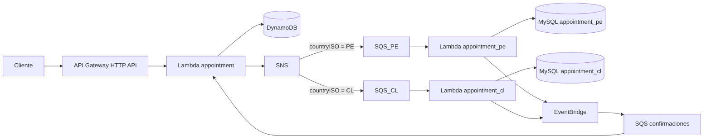

# Medical Appointment API

API serverless para solicitar citas médicas en Perú y Chile y consultar su estado. El registro es asíncrono: `POST /appointments` acepta la solicitud con estado `pending`; el procesamiento posterior la deja en `completed` o `rejected`. Los datos de catálogo y las citas de ejemplo son ficticios.

La especificación de los endpoints, sus respuestas y errores está en [OpenAPI/Swagger](docs/openapi.yaml). Puede abrirse con [Swagger Editor](https://editor.swagger.io/) mediante **File → Import File**.

## Arquitectura



El dominio (`src/domain`) define las citas y sus estados. Los casos de uso y puertos (`src/application`) contienen la coordinación del negocio sin depender de AWS ni de MySQL. Los adaptadores (`src/adapters`) implementan HTTP, DynamoDB, SNS, SQS, MySQL y EventBridge. Los handlers (`src/handlers`) conectan las Lambdas con esos casos de uso.

Se usa el **patrón Repository**: los casos de uso dependen de los puertos `AppointmentRepository` y `CountryAppointmentRepository`; los adaptadores de DynamoDB y MySQL aportan sus implementaciones. Las dependencias se inyectan desde los handlers. El mismo caso de uso de registro sirve a PE y CL, cada uno con su base y usuario MySQL.

Las entregas repetidas de mensajes conservan `appointmentId`. DynamoDB utiliza escrituras y cambios de estado condicionales; MySQL impone unicidad en `appointment_id` y `schedule_id`. Si otro asegurado ocupa el espacio, la solicitud termina en `rejected`. El modelo de DynamoDB se detalla en [docs/dynamodb.md](docs/dynamodb.md).

## Requisitos

- Node.js 24 y pnpm 12 (la versión del proyecto está en `package.json`).
- Serverless Framework 4, instalado como dependencia de desarrollo y con su acceso CLI configurado.
- Cuenta AWS con permisos para desplegar el servicio mediante CloudFormation, incluidos IAM, Lambda, API Gateway, DynamoDB, SNS, SQS, EventBridge, S3 y recursos de VPC. La identidad que despliega debe poder leer los dos secretos de aplicación (`secretsmanager:GetSecretValue`).
- Una instancia RDS MySQL existente en `us-east-1`, en la misma VPC que las Lambdas de país, con las bases `appointment_pe` y `appointment_cl`. RDS **no** se crea con Serverless Framework.

[db/README.md](db/README.md) explica la creación de RDS, las migraciones, los catálogos ficticios, los horarios y los permisos mínimos de `app_pe` y `app_cl`. Cada base contiene centros, especialidades, médicos y espacios de 30 minutos. `appointments.schedule_id` es único dentro de cada base.

## Configuración local

```sh
pnpm install --frozen-lockfile
cp .env.example .env
```

Completar `.env` con `VPC_ID`, `SUBNET_ID`, `RDS_SECURITY_GROUP_ID`, `RDS_HOST`, `MYSQL_USER_PE` y `MYSQL_USER_CL`. La subred, el security group de RDS y la instancia deben pertenecer a la misma VPC. Serverless Framework 4 carga `.env` automáticamente al evaluar `${env:...}`. `.env` está ignorado por Git y no contiene contraseñas.

Las contraseñas de aplicación se guardan en **AWS Secrets Manager**, en `us-east-1`, con una clave JSON llamada exactamente `password`:

| Secreto | Usuario MySQL |
| --- | --- |
| `medical-appointment-api/dev/mysql/app-pe` | `app_pe` |
| `medical-appointment-api/dev/mysql/app-cl` | `app_cl` |

`serverless.yml` usa referencias dinámicas de CloudFormation para proporcionar `MYSQL_PASSWORD` a cada Lambda de país. CloudFormation resuelve el valor durante el despliegue; cambiar después un secreto no actualiza por sí solo la configuración ya desplegada de Lambda. El certificado público de RDS se incluye en `certs/rds-us-east-1-ca.crt`; `global-bundle.pem` queda fuera de Git y del paquete.

Serverless Framework crea el security group de las Lambdas de país, la regla que les permite acceder a RDS por TCP 3306 y un endpoint privado de VPC para publicar en EventBridge por HTTPS. Solo `appointment_pe` y `appointment_cl` se conectan a la VPC. El endpoint de VPC y la instancia RDS generan costes mientras permanezcan activos; revisar AWS Budgets para esta cuenta.

## Validación y despliegue

Antes de desplegar:

```sh
pnpm typecheck
pnpm test
pnpm exec serverless print
pnpm exec serverless package
```

`serverless package` crea un ZIP local en `.serverless/` sin desplegarlo. Revisar que el ZIP incluya `certs/rds-us-east-1-ca.crt` y no incluya `global-bundle.pem`. La verificación del ZIP requiere ejecutar ese comando en el entorno que tenga configurado el acceso AWS para Serverless.

Cuando la configuración y el paquete estén revisados, el propietario de la cuenta ejecuta:

```sh
pnpm exec serverless deploy
```

El servicio usa la región `us-east-1` y el stage `dev`. Guardar la URL HTTP API que muestre el despliegue; esa URL será la base de los ejemplos siguientes y se añadirá a la sección `servers` de OpenAPI después de probarla. No se necesita crear manualmente DynamoDB, SNS, SQS, EventBridge ni las Lambdas.

## Uso de la API

La carga inicial de demostración de esta entrega creó **840 horarios por país**, con `scheduleId` del `1` al `840` en cada base. Los IDs de PE y CL son independientes. Para probar la API sin acceso a MySQL, usa uno de estos horarios de ejemplo:

| País | `scheduleId` sugeridos |
| --- | --- |
| PE | `1`, `3`, `5`, `7`, `9` |
| CL | `2`, `4`, `6`, `8`, `10` |

Cada horario admite **una sola cita por país**. Si otro usuario ya tomó un ID, el `GET` mostrará `rejected` con motivo `SLOT_UNAVAILABLE`; prueba otro ID de la tabla con una **nueva** `Idempotency-Key`.

Usar exactamente la URL entregada por Serverless, sin agregar una ruta de stage por cuenta propia:

```sh
API_URL='https://URL_ENTREGADA_POR_SERVERLESS'

curl -i -X POST "$API_URL/appointments" \
  -H 'Content-Type: application/json' \
  -H 'Idempotency-Key: ejemplo-pe-001' \
  -d '{"insuredId":"00123","scheduleId":1,"countryISO":"PE"}'

curl -i "$API_URL/appointments/00123"

curl -i -X POST "$API_URL/appointments" \
  -H 'Content-Type: application/json' \
  -H 'Idempotency-Key: ejemplo-cl-001' \
  -d '{"insuredId":"00456","scheduleId":2,"countryISO":"CL"}'

curl -i "$API_URL/appointments/00456"
```

El `insuredId` es texto de **exactamente cinco dígitos** y conserva los ceros iniciales.

Una solicitud nueva responde `202 Accepted` con `appointmentId`, `status: "pending"` y un mensaje de procesamiento. `GET /appointments/{insuredId}` devuelve las solicitudes del asegurado, ordenadas por `createdAt` descendente; puede mostrar `pending` hasta que llegue la confirmación. Repetir el mismo POST con la misma `Idempotency-Key` devuelve la cita existente con `200`; reutilizar esa clave para otro cuerpo devuelve `409`.

Si POST responde `503` con `DISPATCH_UNAVAILABLE`, la solicitud ya fue guardada. Si se proporcionó `Idempotency-Key`, reintentar con la misma clave recupera el mismo `appointmentId`. Sin esa clave, otro POST puede crear una solicitud adicional. El contrato completo y los ejemplos de errores están en [docs/openapi.yaml](docs/openapi.yaml).

## Comprobación del flujo desplegado

1. Registrar una solicitud PE y otra CL con horarios libres y claves de idempotencia distintas.
2. Consultar por `insuredId` hasta ver `completed` o `rejected`. Un `pending` transitorio es normal.
3. Para solicitudes `completed`, comprobar que cada `appointment_id` aparece una sola vez en `appointments` de la base del país correcto.
4. Repetir un POST con su misma clave y comprobar que devuelve el mismo `appointmentId`, sin una segunda fila MySQL.
5. Consultar CloudWatch Logs usando `appointmentId` para seguir errores del flujo, sin publicar contraseñas ni datos reales de pacientes.

El repositorio no incluye credenciales AWS, contraseñas MySQL ni datos reales de asegurados.
