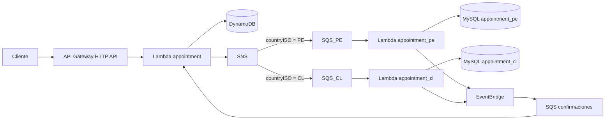

# Medical Appointment API

API serverless para solicitar citas médicas en Perú y Chile y consultar su estado. El registro es asíncrono: `POST /appointments` acepta la solicitud con estado `pending`; el procesamiento posterior la deja en `completed` o `rejected`. Los datos de catálogo y las citas de ejemplo son ficticios.

La especificación de los endpoints, sus respuestas y errores está en [OpenAPI/Swagger](docs/openapi.yaml). Puede abrirse con [Swagger Editor](https://editor.swagger.io/) mediante **File → Import File**.

## Arquitectura



El dominio (`src/domain`) define las citas y sus estados. Los casos de uso y puertos (`src/application`) contienen la coordinación del negocio sin depender de AWS ni de MySQL. Los adaptadores (`src/adapters`) implementan HTTP, DynamoDB, SNS, SQS, MySQL y EventBridge. Los handlers (`src/handlers`) conectan las Lambdas con esos casos de uso.

Se usa el **patrón Repository**: los casos de uso dependen de los puertos `AppointmentRepository` y `CountryAppointmentRepository`; los adaptadores de DynamoDB y MySQL aportan sus implementaciones. Las dependencias se inyectan desde los handlers. El mismo caso de uso de registro sirve a PE y CL, cada uno con su base y usuario MySQL.

Las entregas repetidas de mensajes conservan `appointmentId`. DynamoDB utiliza escrituras y cambios de estado condicionales; MySQL impone unicidad en `appointment_id` y `schedule_id`. Si otro asegurado ocupa el espacio, la solicitud termina en `rejected`.

El modelo de DynamoDB se detalla a continuación:

| Registro | PK | SK | Datos |
| --- | --- | --- | --- |
| Cita | `INSURED#insuredId` | `APPOINTMENT#appointmentId` | Solicitud, estado y fechas |
| Idempotencia | `IDEMPOTENCY#SHA-256(clave)` | `REQUEST` | Huella del cuerpo y referencia a la cita |

La tabla usa capacidad bajo demanda. `GET /appointments/{insuredId}` consulta la partición del asegurado con `Query` consistente y paginada, y devuelve las citas por `createdAt` descendente.

Con `Idempotency-Key`, una transacción crea ambos registros. Repetir la clave con el mismo cuerpo recupera la cita existente; usarla con otro cuerpo produce `409 REQUEST_CONFLICT`. La clave original no se guarda. `publishedAt` registra el envío a SNS y no aparece en la API.

## Requisitos

- Node.js 24 y pnpm 12 (la versión del proyecto está en `package.json`).
- Serverless Framework 4, instalado como dependencia de desarrollo y con su acceso CLI configurado.
- Cuenta AWS con permisos para desplegar el servicio mediante CloudFormation, incluidos IAM, Lambda, API Gateway, DynamoDB, SNS, SQS, EventBridge, S3 y recursos de VPC. La identidad que despliega debe poder leer los dos secretos de aplicación (`secretsmanager:GetSecretValue`).
- Una instancia RDS MySQL existente en `us-east-1`, en la misma VPC que las Lambdas de país, con las bases `appointment_pe` y `appointment_cl`. RDS **no** se crea con Serverless Framework.

Para preparar una instancia RDS MySQL, ejecutar [000_create_databases.sql](db/migrations/000_create_databases.sql) como administrador. En cada base creada, ejecutar [001_create_schema.sql](db/migrations/001_create_schema.sql), la carga de catálogo correspondiente ([PE](db/migrations/002_seed_catalog_pe.sql) o [CL](db/migrations/002_seed_catalog_cl.sql)) y [refresh_demo_slots.sql](db/seeds/refresh_demo_slots.sql). Cada base contiene centros, especialidades, médicos y horarios de 30 minutos. Los usuarios `app_pe` y `app_cl` requieren `SELECT, INSERT` en sus respectivas tablas `appointments` y `SELECT` en `schedule_slots`; `appointments.schedule_id` es único dentro de cada base.

## Configuración local

```sh
pnpm install --frozen-lockfile
cp .env.example .env
```

Completar `.env` con `VPC_ID`, `SUBNET_ID`, `RDS_SECURITY_GROUP_ID`, `RDS_HOST`, `MYSQL_USER_PE` y `MYSQL_USER_CL`. La subred, el security group de RDS y la instancia deben pertenecer a la misma VPC. Serverless Framework 4 carga `.env` automáticamente al evaluar `${env:...}`. `.env` está ignorado por Git y no contiene contraseñas.

Las contraseñas de aplicación se guardan en **AWS Secrets Manager**, en `us-east-1`, con una clave JSON llamada exactamente `password`:

| Secreto | Usuario MySQL |
| --- | --- |
| `medical-appointment-api/dev/mysql/app-pe` | `app_pe` |
| `medical-appointment-api/dev/mysql/app-cl` | `app_cl` |

`serverless.yml` usa referencias dinámicas de CloudFormation para proporcionar `MYSQL_PASSWORD` a cada Lambda de país. CloudFormation resuelve el valor durante el despliegue; cambiar después un secreto no actualiza por sí solo la configuración ya desplegada de Lambda. El certificado público de RDS se incluye en `certs/rds-us-east-1-ca.crt`; `global-bundle.pem` queda fuera de Git y del paquete.

Serverless Framework crea el security group de las Lambdas de país, la regla que les permite acceder a RDS por TCP 3306 y un endpoint privado de VPC para publicar en EventBridge por HTTPS. Solo `appointment_pe` y `appointment_cl` se conectan a la VPC. El endpoint de VPC y la instancia RDS generan costes mientras permanezcan activos; revisar AWS Budgets para esta cuenta.

## Validación y despliegue

Antes de desplegar:

```sh
pnpm typecheck
pnpm test
pnpm exec serverless print
pnpm exec serverless package
```

`serverless package` crea un ZIP local en `.serverless/` sin desplegarlo. Revisar que el ZIP incluya `certs/rds-us-east-1-ca.crt` y no incluya `global-bundle.pem`. La verificación del ZIP requiere ejecutar ese comando en el entorno que tenga configurado el acceso AWS para Serverless.

Cuando la configuración y el paquete estén revisados, el propietario de la cuenta ejecuta:

```sh
pnpm exec serverless deploy
```

El servicio usa la región `us-east-1` y el stage `dev`. La API desplegada y probada está disponible en [https://6if1ph23tc.execute-api.us-east-1.amazonaws.com](https://6if1ph23tc.execute-api.us-east-1.amazonaws.com). No se necesita crear manualmente DynamoDB, SNS, SQS, EventBridge ni las Lambdas.

## Uso de la API

API Gateway aplica un objetivo de **5 solicitudes por segundo por ruta** (POST y GET), con ráfaga de 5. La capacidad objetivo combinada es 10 solicitudes por segundo cuando ambas rutas reciben tráfico; el límite no es un contador global exacto. Las solicitudes excedentes pueden recibir `429 Too Many Requests` y deben reintentarse más tarde.

La carga inicial de demostración de esta entrega creó **840 horarios por país**, con `scheduleId` del `1` al `840` en cada base. Los IDs de PE y CL son independientes. Para probar la API sin acceso a MySQL, usa uno de estos horarios de ejemplo:

| País | `scheduleId` sugeridos |
| --- | --- |
| PE | `1`, `3`, `5`, `7`, `9` |
| CL | `2`, `4`, `6`, `8`, `10` |

Cada horario admite **una sola cita por país**. Si un horario no existe o ya está ocupado, el `GET` mostrará `rejected`, `rejectionReason: "SLOT_UNAVAILABLE"` y `rejectionMessage: "El horario solicitado no está disponible."`. Prueba otro ID de la tabla con una **nueva** `Idempotency-Key`.

Los comandos reproducibles y las respuestas esperadas están al final, en [Prueba manual con curl](#prueba-manual-con-curl).

El `insuredId` es texto de **exactamente cinco dígitos** y conserva los ceros iniciales.

Una solicitud nueva responde `202 Accepted` con `appointmentId` y `status: "pending"`. `GET /appointments/{insuredId}` devuelve las solicitudes del asegurado, ordenadas por `createdAt` descendente; puede mostrar `pending` hasta que llegue la confirmación.

| Caso | Respuesta pública | Significado |
| --- | --- | --- |
| Repetir el POST con la misma `Idempotency-Key` y el mismo cuerpo | `200`, con el mismo `appointmentId` | Recupera la solicitud existente sin crear otra cita. |
| Reutilizar esa clave con un cuerpo distinto | `409 REQUEST_CONFLICT`: «No se pudo procesar la solicitud por un conflicto.» | La clave ya corresponde a otra solicitud; no indica que el horario esté ocupado. |
| No se pudo confirmar el envío para procesamiento | `503 SERVICE_UNAVAILABLE`: «No fue posible confirmar el procesamiento. Consulta el estado antes de reintentar.» | La solicitud ya se guardó; la respuesta incluye su `appointmentId`. |
| Horario inexistente u ocupado | GET `200` con cita `rejected`, `rejectionReason: "SLOT_UNAVAILABLE"` y `rejectionMessage: "El horario solicitado no está disponible."` | Ambas causas se presentan igual en la API; internamente se distinguen. |

Si se recibe `503`, consulta primero las citas del asegurado. Si proporcionaste `Idempotency-Key`, reintenta el mismo POST con esa misma clave para recuperar el mismo `appointmentId`. Sin clave, otro POST puede crear una solicitud adicional. Los errores públicos son genéricos; la lógica interna conserva el motivo exacto para procesar reintentos. El contrato completo está en [OpenAPI](docs/openapi.yaml).

## Comprobación del flujo desplegado

1. Registrar una solicitud PE y otra CL con horarios libres y claves de idempotencia distintas.
2. Consultar por `insuredId` hasta ver `completed` o `rejected`. Un `pending` transitorio es normal.
3. Para solicitudes `completed`, comprobar que cada `appointment_id` aparece una sola vez en `appointments` de la base del país correcto.
4. Repetir un POST con su misma clave y comprobar que devuelve el mismo `appointmentId`, sin una segunda fila MySQL.
5. Consultar CloudWatch Logs usando `appointmentId` para seguir errores del flujo, sin publicar contraseñas ni datos reales de pacientes.

El repositorio no incluye credenciales AWS, contraseñas MySQL ni datos reales de asegurados.

## Prueba manual con curl

Ejecuta estos comandos en **la misma terminal**. La URL base no lleva `/dev`. `RUN_ID` hace que las claves de esta ejecución sean nuevas; los `insuredId` son ficticios. Los valores de `appointmentId` y `createdAt` cambiarán en cada solicitud.

```sh
API_URL='https://6if1ph23tc.execute-api.us-east-1.amazonaws.com'
RUN_ID=$(date +%s)
PE_KEY="revision-pe-$RUN_ID"
CL_KEY="revision-cl-$RUN_ID"
REJECT_KEY="revision-rejected-$RUN_ID"
```

### 1. Solicitar una cita PE

```sh
curl -i -X POST "$API_URL/appointments" \
  -H 'Content-Type: application/json' \
  -H "Idempotency-Key: $PE_KEY" \
  -d '{"insuredId":"00123","scheduleId":1,"countryISO":"PE"}'
```

**Esperado:** HTTP `202`, un `appointmentId` nuevo y `status: "pending"`. Conserva ese `appointmentId` para compararlo con los siguientes resultados.

### 2. Consultar la cita PE

```sh
curl -i -X GET "$API_URL/appointments/00123"
```

**Esperado:** HTTP `200`. La cita con el `appointmentId` anterior puede estar primero en `pending`; repite el GET hasta ver `completed`. Si el horario `1` ya fue reservado, verás `rejected` con `rejectionReason: "SLOT_UNAVAILABLE"`: usa otro horario PE sugerido (`3`, `5`, `7` o `9`) y una clave nueva.

### 3. Solicitar y consultar una cita CL

```sh
curl -i -X POST "$API_URL/appointments" \
  -H 'Content-Type: application/json' \
  -H "Idempotency-Key: $CL_KEY" \
  -d '{"insuredId":"00456","scheduleId":2,"countryISO":"CL"}'

curl -i -X GET "$API_URL/appointments/00456"
```

**Esperado:** POST `202`; GET `200` con la cita primero en `pending` y después en `completed`. Si el horario `2` ya está ocupado, usa otro horario CL sugerido (`4`, `6`, `8` o `10`) con una clave nueva. Los horarios de PE y CL pertenecen a bases diferentes.

### 4. Repetir el POST de PE con la misma clave y el mismo cuerpo

```sh
curl -i -X POST "$API_URL/appointments" \
  -H 'Content-Type: application/json' \
  -H "Idempotency-Key: $PE_KEY" \
  -d '{"insuredId":"00123","scheduleId":1,"countryISO":"PE"}'
```

**Esperado:** HTTP `200`, el **mismo `appointmentId`** del paso 1 y el mensaje `Se recuperó una solicitud existente.`. Si cambiaste de horario en el paso 2, repite aquí el cuerpo que realmente enviaste con `$PE_KEY`.

### 5. Reutilizar la clave de PE con otro cuerpo

```sh
curl -i -X POST "$API_URL/appointments" \
  -H 'Content-Type: application/json' \
  -H "Idempotency-Key: $PE_KEY" \
  -d '{"insuredId":"00123","scheduleId":3,"countryISO":"PE"}'
```

**Esperado:** HTTP `409` con `{"error":{"code":"REQUEST_CONFLICT","message":"No se pudo procesar la solicitud por un conflicto."}}`. Esta respuesta significa que la clave ya corresponde a otra solicitud; no reserva el horario `3`.

### 6. Consultar un horario inexistente

```sh
curl -i -X POST "$API_URL/appointments" \
  -H 'Content-Type: application/json' \
  -H "Idempotency-Key: $REJECT_KEY" \
  -d '{"insuredId":"00999","scheduleId":999999,"countryISO":"PE"}'

curl -i -X GET "$API_URL/appointments/00999"
```

**Esperado:** POST `202`; después, GET `200` con la cita en `rejected`, `rejectionReason: "SLOT_UNAVAILABLE"` y `rejectionMessage: "El horario solicitado no está disponible."`. Si el GET aún muestra `pending`, repítelo tras unos segundos. El horario inexistente y el ocupado tienen la misma respuesta pública.
